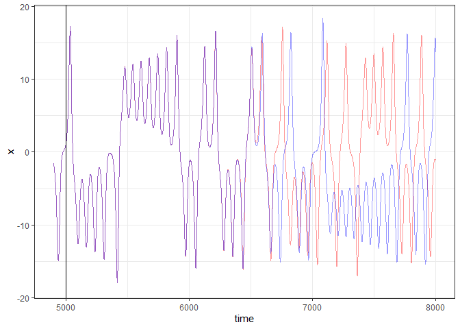

<!-- README.md is generated from README.Rmd. Please edit that file -->

# NVAR: Nonlinear Vector Autoregression Models

<!-- badges: start -->

[](https://github.com/Sciurus365/NVAR/actions/workflows/R-CMD-check.yaml)
[](https://CRAN.R-project.org/package=NVAR)
<!-- badges: end -->

Estimate nonlinear vector autoregression models (also known as the next
generation reservoir computing) for nonlinear dynamic systems. The
algorithm was described by Gauthier et al. (2021)
<doi:10.1038/s41467-021-25801-2>.

## Installation

You can install the development version of NVAR from
[GitHub](https://github.com/) with:

``` r
# install.packages("devtools")
devtools::install_github("Sciurus365/NVAR")
```

## Example

This is an example for the Lorenz model.

``` r
library(NVAR)

testdata <- nonlinearTseries::lorenz()
testdata <- tibble::as_tibble(testdata)
t1 <- NVAR(data = testdata, vars = c("x", "y", "z"), s = 2, k = 2, p = 2, alpha = 1e-3)
t1_sim <- sim_NVAR(t1, length = 5000)


realdata <- nonlinearTseries::lorenz(time = seq(0, 100, by = .01)) %>% tibble::as_tibble()

library(ggplot2)
ggplot(realdata) +
  geom_line(aes(x = 1:10001, y = x), color = "red", alpha = 0.4) +
  geom_line(aes(x = 1:10001, y = x), data = t1_sim, color = "blue", alpha = 0.4) +
  geom_vline(xintercept = 5000) +
  theme_bw() +
  xlim(c(4900, 8000)) +
  labs(x = "time", y = "x")
```



``` r

# Red line: real data.
# Blue line: simulated data with the NVAR.
# Black vertical line: when the simulation starts.
```
